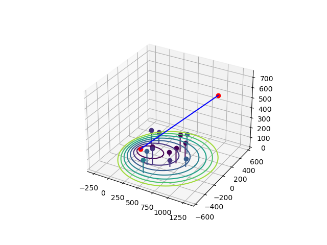
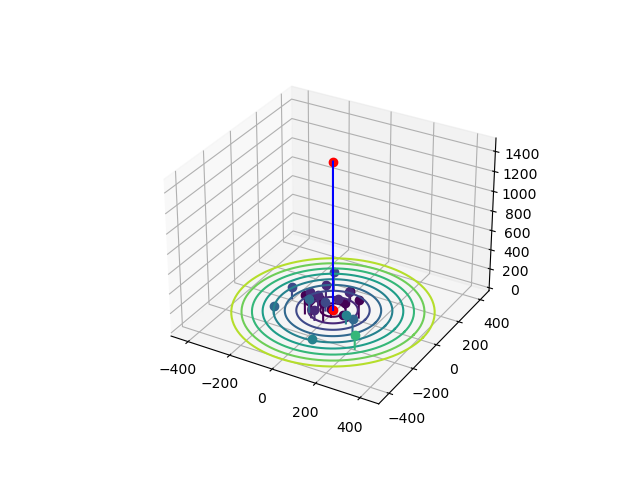
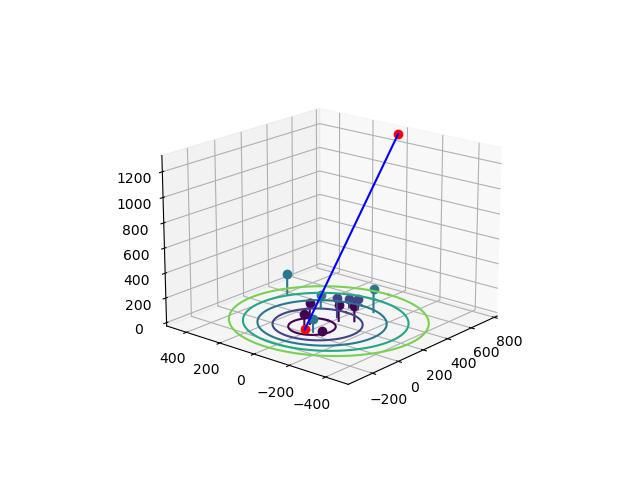

# UAV_Scatterers

Generates scatterers based on 'Wentz, M., & Stojanovic, M. (2015, September). A MIMO radio channel model for low-altitude air-to-ground communication systems. In 2015 IEEE 82nd Vehicular Technology Conference (VTC2015-Fall) (pp. 1-6). IEEE.'

If you use the code for estimation, consider citing "Jha, N. K., & Lau, V. K. (2023). Temporally Correlated Compressed sensing using Generative Models for Channel Estimation in Unmanned Aerial Vehicles. IEEE Transactions on Wireless Communications."

